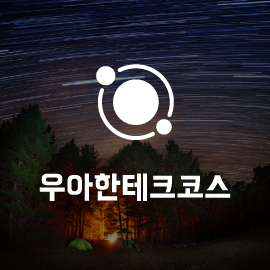

[우아한테크코스](https://www.woowacourse.io/) 학습 내용을 정리합니다.

## 🐣 Level 1 (2023.02.08. ~ 03.31.)
| Project   |Repository| Pull Requests                                                                                                                                            |
|-----------|-|----------------------------------------------------------------------------------------------------------------------------------------------------------|
| 자동차 경주 게임 |[java-racingcar](https://github.com/woowacourse/java-racingcar)| [1단계 - 자동차 경주 구현](https://github.com/woowacourse/java-racingcar/pull/523) [2단계 - 자동차 경주 리팩터링](https://github.com/woowacourse/java-racingcar/pull/597) |
| 사다리       |[java-lotto](https://github.com/woowacourse/java-ladder)| [1단계 - 사다리 ](https://github.com/woowacourse/java-ladder/pull/104) [2단계 - 사다리 게임 실행](https://github.com/woowacourse/java-ladder/pull/221)             |
| 블랙잭       |[java-blackjack](https://github.com/woowacourse/java-blackjack)| [1단계 - 블랙잭](https://github.com/woowacourse/java-blackjack/pull/413) [2단계 - 블랙잭(베팅)](https://github.com/woowacourse/java-blackjack/pull/532)          |
| 체스        |[java-chess](https://github.com/woowacourse/java-chess)| [1,2단계 - 체스](https://github.com/woowacourse/java-chess/pull/483) [3,4단계 - 체스](https://github.com/woowacourse/java-chess/pull/550)                    |

### 📔 학습 로그
- [방어적 복사](https://jeoninpyo726.tistory.com/16)
- [상속과 조합](https://jeoninpyo726.tistory.com/17)
- [객체의 선언과 초기화 , 양방향 의존성](https://jeoninpyo726.tistory.com/19)

### 📝 글쓰기
- [우아한테크코스 한 달 생활기(우아한테크코스 생존법)](https://jeoninpyo726.tistory.com/18)

## 🐥 Level 2 (2023.04.11. ~ 06.09.)
| Project     | Repository                                                             | Pull Requests                                                                                                                                                          |
|-------------|------------------------------------------------------------------------|------------------------------------------------------------------------------------------------------------------------------------------------------------------------|
| 웹 기반 자동차 게임 | [jwp-racingcar](https://github.com/woowacourse/jwp-racingcar)          | [1단계 - 웹 자동차 경주](https://github.com/woowacourse/jwp-racingcar/pull/21) [2단계 - 웹 자동차 경주](https://github.com/woowacourse/jwp-racingcar/pull/140)                     |
| 장바구니        | [jwp-shopping-cart](https://github.com/woowacourse/jwp-shopping-cart)  | [1단계 - 상품 관리 기능](https://github.com/woowacourse/jwp-shopping-cart/pull/194) [2단계 - 상품 관리 기능](https://github.com/woowacourse/jwp-shopping-cart/pull/293)            |
| 지하철 경로 조회   | [jwp-subway-path](https://github.com/woowacourse/jwp-subway-path)      | [1단계 - 지하철 정보 관리 기능](https://github.com/woowacourse/jwp-subway-path/pull/73) [2,3단계 - 경로 조회 기능, 요금 정책 추가](https://github.com/woowacourse/jwp-subway-path/pull/163) |
| 장바구니 - 협업   | [jwp-shopping-order](https://github.com/woowacourse/jwp-shopping-order) | [2단계 - 주문기능 구현](https://github.com/woowacourse/jwp-shopping-order/pull/60)             |

### 📗 학습 로그
- [스프링이란?](https://jeoninpyo726.tistory.com/20)
- [DI 와 빈 스코브](https://jeoninpyo726.tistory.com/21)
- [@Repository의 예외처리](https://jeoninpyo726.tistory.com/22)
- [CI/CD](https://jeoninpyo726.tistory.com/24)
- [Swagger를 이용한 API명세서 관리하기](https://jeoninpyo726.tistory.com/25)

### 📝 글쓰기
- [노는 습관](https://jeoninpyo726.tistory.com/23)

## 🐓 Level 3 (2023.06.27. ~ 08.18.)
**📝같은 글을 한 번에 포스팅하자!  동글✍️**
- [서비스 링크](https://donggle.blog)
- [GitHub](https://github.com/woowacourse-teams/2023-dong-gle)

### 📕 학습 로그
- [자바 버전 어떤거 사용해야할까?(jdk11 VS jdk17)](https://jeoninpyo726.tistory.com/62)
- [JWT의 관하여](https://jeoninpyo726.tistory.com/70)
- [OAuth의 관하여](https://jeoninpyo726.tistory.com/72)
- [트랜잭션과 트랜잭션 격리수준](https://jeoninpyo726.tistory.com/75)
- [도커의 관하여](https://jeoninpyo726.tistory.com/76)

## 🦖 Level 4 (2022.08.31. ~ 10.27.)

|Project|Repository| Pull Requests                                                                                                                                                                                                                                                           |
|-|-|-------------------------------------------------------------------------------------------------------------------------------------------------------------------------------------------------------------------------------------------------------------------------|
|톰캣 구현하기|[jwp-dashboard-http](https://github.com/woowacourse/jwp-dashboard-http)| [1,2단계](https://github.com/woowacourse/jwp-dashboard-http/pull/377) [3,4단계](https://github.com/woowacourse/jwp-dashboard-http/pull/427)                                                                                                                             |
|`@MVC` 구현하기|[jwp-dashboard-mvc](https://github.com/woowacourse/jwp-dashboard-mvc)| [1단계](https://github.com/woowacourse/jwp-dashboard-mvc/pull/337) [2단계](https://github.com/woowacourse/jwp-dashboard-mvc/pull/493) [3단계](https://github.com/woowacourse/jwp-dashboard-mvc/pull/536)                                                              |
|JDBC 라이브러리 구현하기|[jwp-dashboard-jdbc](https://github.com/woowacourse/jwp-dashboard-jdbc)| [1,2단계](https://github.com/woowacourse/jwp-dashboard-jdbc/pull/370) [3,4단계](https://github.com/woowacourse/jwp-dashboard-jdbc/pull/522)                                                                                                                             |

### 📓 학습 로그
- [HTTP와 톰캣은 뭘까?](https://jeoninpyo726.tistory.com/81)
- [Thread 와 톰캣 튜닝하기](https://jeoninpyo726.tistory.com/82)
- [전략패턴을 이용한 외부API 추상화하기](https://jeoninpyo726.tistory.com/83)
- [동시성 문제 해결을 위한 회원가입 기능 개선](https://jeoninpyo726.tistory.com/84)
- [파사드 패턴으로 외부 API와 DB 트랜잭션 범위 분리하기](https://jeoninpyo726.tistory.com/85)
- [LinkedList로 글과 카테고리의 순서 구현했을 때 동시성 제어](https://jeoninpyo726.tistory.com/86)
- [동글 프로젝트 쿼리 개선기](https://jeoninpyo726.tistory.com/94)
- [동글 프로젝트 테스트 코드 개선 및 최적화](https://jeoninpyo726.tistory.com/98)

### Contribution
- [Apache Tomcat](https://github.com/apache/tomcat/pull/655)